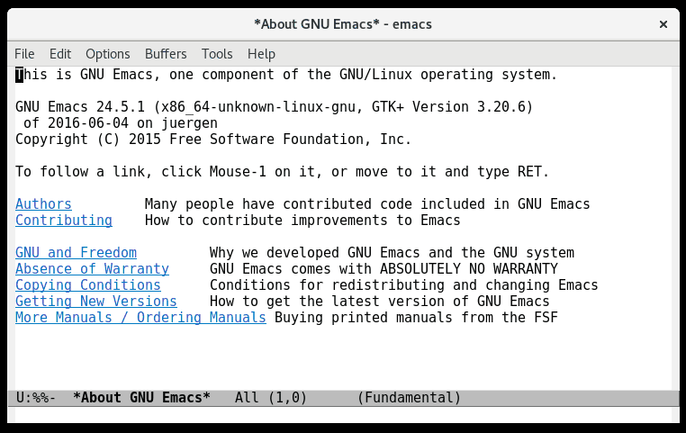
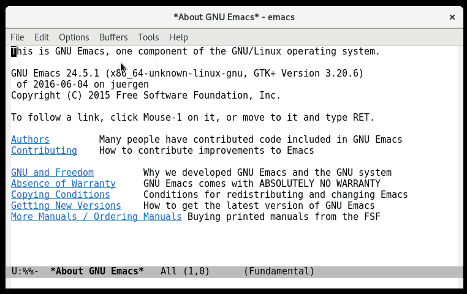

# Refine
[](https://travis-ci.org/Wilfred/refine)
[](https://coveralls.io/github/Wilfred/refine?branch=master)
[](http://melpa.org/#/refine)
[](http://stable.melpa.org/#/refine)

***finally, an editor for Emacs!***

Refine provides a convenient UI for editing variables. Refine is not
for editing files, but for changing elisp variables, particularly
lists.

<!-- markdown-toc start - Don't edit this section. Run M-x markdown-toc-generate-toc again -->
**Table of Contents**

- [Refine](#refine)
    - [Usage examples](#usage-examples)
    - [Limitations](#limitations)
    - [Keybindings](#keybindings)
    - [License](#license)
    - [Installation](#installation)
    - [Tests](#tests)
    - [Related projects](#related-projects)

<!-- markdown-toc end -->

## Usage examples



Refine is great for editing large lists, such as hooks. In the above
example, I insert and edit values in `prog-mode-hook`.



Refine is also a valuable debugging tool. In this example, I reorder
items in the `kill-ring` so I paste the value I want.

## Limitations

Refine deliberately **modifies values in place**. This is useful if
you're working with a list that's shared between multiple variables,
such as `font-lock-defaults`.

In some cases, this isn't possible (e.g. inserting into an empty
list). In these cases, refine will overwrite your variable.

## Keybindings

Editing:

|  command               | binding           |
|------------------------|-------------------|
| `refine-edit`          | <kbd>e</kbd> or <kbd>RET</kbd>      |
| `refine-cycle`         | <kbd>c</kbd>      |
| `refine-insert`        | <kbd>i</kbd>      |
| `refine-insert-after`  | <kbd>a</kbd>      |
| `refine-delete`        | <kbd>k</kbd>      |
| `refine-move-forward`  | <kbd>s</kbd> or <kbd>&lt;M-up&gt;</kbd>   |
| `refine-move-backward` | <kbd>w</kbd> or <kbd>&lt;M-down&gt;</kbd> |

Moving around:

|  command               | binding           |
|------------------------|-------------------|
| `refine-next`          | <kbd>n</kbd>      |
| `refine-previous`      | <kbd>p</kbd>      |

Buffer commands:

|  command               | binding           |
|------------------------|-------------------|
| `refine-update`        | <kbd>g</kbd>      |
| `kill-this-buffer`     | <kbd>q</kbd>      |


## License

GPLv3.

## Installation

Install from MELPA (recommended), or add refine.el to `load-path`.

## Tests

You can run tests inside Emacs by just opening the test files and
doing `M-x eval-buffer` `M-x ert RET t RET`.

Alternatively, you can run the test from a shell:

```
$ cask install
$ cask exec ert-runner
```

Note that refine has had infinite loop bugs during development, so you
may need to press Ctrl-C if tests don't terminate.

## Related projects

`counsel-set-variable` (part of
[ivy](https://github.com/abo-abo/swiper)) is also an excellent way of
editing variables in Emacs.

[edit-list](https://github.com/emacsmirror/edit-list) provides list
editing in a very similar style to refine. It doesn't edit in-place,
nor work as well for hooks, but does provide an elegant, Emacsy UI.
